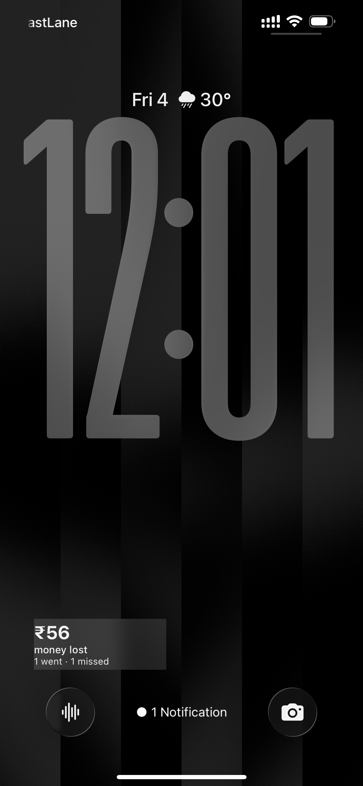

# gymbro

**A gym tracker that measures one thing: how much money you're wasting.**

You paid for a membership. Every session you skip has a price. gymbro puts that number on your lock screen and lets it climb.

Sessions log themselves. Walk into your gym, stay long enough, walk out. It counts. You never open anything, tap anything, or remember anything.



---

## Is this for you?

You need:

- An **iPhone**. There's no Android version yet.
- A **paid gym membership** with a known cost and end date. The whole thing works by dividing that fee across your planned sessions.
- About **eight minutes** to set it up.

Optional:

- A **Mac with Xcode**, if you want the app on top of the widgets. Skip it and everything still works.

This isn't for you if you want workout logging, reps, sets, weights, calories or heart rate. gymbro doesn't know or care what you did inside the gym. It knows you were there.

---

## How it works

### The money

You tell it what you paid and how long the membership runs. It counts every day you plan to train between those two dates and divides.

> ₹10,000 over four months, training Monday to Friday, is 89 sessions. Each one you skip costs **₹112**.

Miss a Tuesday and the counter goes up by ₹112 and stays up. Rest days cost nothing. The number never goes down, which is the whole point.

Fewer training days makes each miss hurt more. Three days a week instead of five means ₹192 a skip. The maths punishes a light schedule on its own.

### The detection

Two iOS automations do the work. Arrive at your gym and one writes `IN` with a timestamp into a text file. Leave and the other writes `OUT`. If the gap clears your minimum, that day counts.

Set the minimum to your shortest real session, not your average. If you sometimes do 45 minutes, set it to 40. Better to occasionally credit a short visit than to have a real session silently not count, because that's what makes people stop trusting the thing and give up on it.

Two problems are already handled. GPS drift sometimes fires arrival twice, so the earliest one of the day wins and a duplicate can never shorten your session. And when the automation misses completely, which happens about once a month, `GymManual` logs a session by hand. Manual entries are tracked separately so the number never quietly lies to you.

### The streak

Miss a scheduled day and the streak breaks at midnight. No grace period.

But if you train on a day that wasn't scheduled, say a Saturday, that session becomes a repair token. The app offers it and you can spend it to undo one broken weekday from that same week. It never applies itself. You have to choose it.

Repairing gives the money back too, since you did the session, just later.

### The two sides

The app opens on **Burnt**: money gone, sessions missed, miss rate, how bad it gets if nothing changes. That's on purpose. It's the screen that makes you go.

**Credit** is a separate tab, white instead of black, holding the good news: streak, longest streak, money earned back, perfect weeks, how often you bounce back after a miss. It's one tap away and the app never opens there. Seeing what you've achieved is nice, and nice isn't what gets you out of bed.

---

## What you get

### On your phone, without opening anything

- Lock screen widget with the amount burnt, right under the clock
- Home screen widget with the same figure plus sessions went and missed
- Automatic logging. Arrive, train, leave, it counts
- A manual override for the days the geofence misses

### In the app

**Burnt**, the screen it opens on:

- Money gone, inside a ring showing how far through the membership you are
- Sessions went, sessions missed, miss rate
- How many more misses before you cross ₹1,000
- Where the burn lands by the end if nothing changes
- The weekday you skip most
- Every scheduled session of the whole membership as a grid, filling in as you go
- A step chart of the money draining away

**Credit**, one tab away and never where you land:

- Current streak and longest streak
- Money earned back
- Turn-up rate, perfect weeks, days since a miss
- How often you show up the day after a miss
- The weekday you're strongest on

**Days:**

- Month calendar with every session and its duration in the cell
- List view grouped by month with arrival times
- Tap any past day to mark it, clear it or excuse it

**Setup:**

- Change the fee, the dates, your training days and the minimum session
- The widgets pick all of it up automatically. No file editing, ever

**Repairs:**

- Train an unscheduled day and it becomes a token
- Spend it to undo one broken day that week, money refunded
- Offered, never automatic, and you can undo it

---

## Setup, part 1: the widgets

Free, no Mac, works on its own. This is the part most people want.

### 1. Install Scriptable

[Scriptable](https://apps.apple.com/app/scriptable/id1405459188) is free on the App Store. Open it once so it creates its iCloud folder.

### 2. Run the installer

In Scriptable tap **+**, paste [`scriptable/Install.js`](scriptable/Install.js), name it `Install`, and run it.

It asks four things:

- What you paid and how many months it covers
- When it started
- Which days you train
- Your shortest real session

Then it writes your config and downloads the other four scripts. Nothing to edit by hand. At the end it tells you what each missed session is going to cost.

### 3. Build the two automations

This is the only part that can't be automated away. iOS doesn't let anyone share a personal automation with a location trigger, so you have to make these yourself.

Open **Shortcuts → Automation → +**

**Arrival**

| | |
|---|---|
| Trigger | **Arrive**, set to your gym |
| Timing | **Run Immediately** |
| Action | **Scriptable → Run Script → GymIn** |
| Run in App | **off** |

**Departure**

| | |
|---|---|
| Trigger | **Leave**, same location |
| Timing | **Run Immediately** |
| Action | **Scriptable → Run Script → GymOut** |
| Run in App | **off** |

Set the radius generously. GPS isn't precise, especially indoors, in basements and inside malls. A tight radius will miss sessions, which is worse than the occasional false positive.

*If the Texts field on Run Script keeps clearing itself, ignore it. These scripts don't use it.*

### 4. Add the widgets

**Home screen:** long press, add a small **Scriptable** widget, tap it, choose `GymWidget`, and set When Interacting to **Run Script** so tapping refreshes it in place.

**Lock screen:** long press the lock screen, Customise, tap the area below the clock, Scriptable, choose the **rectangular** size, set the script to `GymWidget`.

### 5. Test it before you trust it

Run `GymIn` then `GymOut` from inside Scriptable. Open **Files → iCloud Drive → Scriptable → gym_log.txt** and check two lines appeared.

**Delete that file afterwards** so your real counter starts from zero.

The one thing this test can't prove is whether the geofence actually fires when you walk into your gym. You find that out on your first real session, so check the log when you get back.

---

## Setup, part 2: the app (optional)

Adds a calendar, full history, streaks, day by day editing, and settings you can change without touching code. The widgets keep working whether you build this or not.

Requires a Mac with Xcode.

1. New Xcode project, iOS, App, SwiftUI. Name it `gymbro`, lowercase, so the home screen label matches.
2. **Signing & Capabilities**, select your Personal Team, change the bundle identifier to something of your own. Add no capabilities. The app deliberately uses none, which is what keeps it buildable on a free account.
3. Delete the two files Xcode generated, `ContentView.swift` and the one ending `App.swift`, then drag in everything from [`app/`](app/).
4. **Assets → AppIcon**, set Appearances to Any, Dark, Tinted, and drop in the three PNGs.
5. Plug in your iPhone, select it as the destination, hit Run. The first install fails with an untrusted developer error, which is expected. Go to **Settings → General → VPN & Device Management**, trust your Apple ID, then Run again.
6. On first launch it asks for a folder. Choose **iCloud Drive → Scriptable**.

That last step is what ties the app to your widgets. They read and write the same file, so they can never disagree.

If you skipped part 1 and have no config yet, the app then asks you the same four questions the installer would have, and shows you the cost per missed session before you start. You never need to open a code file.

### The seven day thing

A free Personal Team signs builds for seven days. When the app stops opening, plug into the Mac and hit Run. Takes thirty seconds.

Don't delete the app icon first. That wipes the folder permission and you have to grant it again.

Your data is fine either way. It lives in iCloud Drive, not inside the app. You could delete the app permanently and your whole history would still be sitting there.

The widgets never expire. This only affects the app.

---

## Living with it

Day to day you do nothing. Go to the gym, the number stays where it is. Skip, and it moves.

When the geofence misses, open the app, find the day, mark that you went. Or run the `GymManual` script if you didn't build the app.

When you travel or get ill, excuse those days so they cost you nothing. They still break the streak unless you make them up. Money forgives, consistency doesn't.

When you renew, open Setup, change the amount and the two dates, hit Save. The widgets pick up the new numbers on their next refresh.

---

## The honest limitations

**Shared locations are the unsolved one.** Set the minimum session length and the geofence handles most false positives fine, since a quick trip to the shop next door won't clear the threshold. Where it falls apart is when your gym is inside somewhere you already spend hours, like your office building. Then you're inside the radius all day and it looks like a session every single day. The minimum length can't help there, and honestly it makes it worse.

A Bluetooth check would probably fix it, pairing to your earbuds or something in the gym so it only counts when both the location and the device agree. It isn't built yet. If this is your situation, open an issue and say so, because it changes what gets built next.

**iOS fires automations late sometimes.** Usually a few minutes, occasionally not until you unlock the phone. The timestamps stay correct, the widget just catches up behind.

**Presence isn't training.** The log measures how long you were inside the building, which includes parking, stairs, filling your bottle and talking to someone on the way out. A ninety minute workout can read as two and a half hours. That's why there's no "hours trained" metric anywhere in this app. It would be a flattering lie.

**Repairs are generous.** One weekend session rescues any weekday you missed that week. In practice you could skip one weekday a week forever and never break a streak. If that feels too soft, cap it.

**Early numbers mean nothing.** Miss rate, projected burn, best and worst weekday all need a few weeks of data behind them. The app hides most of them until roughly three weeks in.

---

## Stuck? Hand it to an AI

The Shortcuts part trips people up, and screenshots in a README only go so far. If something isn't working, open ChatGPT or Claude, attach the files listed below, and paste this:

```
I'm setting up gymbro, an iPhone gym tracker that logs sessions
automatically using Shortcuts automations and the Scriptable app.
I've attached its README and the scripts.

Here's where I'm stuck:
[describe what you did and what happened]

Walk me through it one step at a time, and ask me for a screenshot
if you need to see what's on my screen. I'm not a developer, so
don't assume I know the terminology.
```

Attach these:

| Your problem | Attach |
|---|---|
| Anything at all | `README.md` |
| Sessions aren't logging | `scriptable/GymIn.js`, `scriptable/GymOut.js`, plus a screenshot of both automations |
| The widget is blank or wrong | `scriptable/GymWidget.js`, plus a screenshot of the widget |
| The installer failed | `scriptable/Install.js` |
| The numbers look wrong | A screenshot of the Setup tab and your `gym_log.txt` |
| Xcode won't build | The Swift file the error points at, plus a screenshot of the error |

One warning. `gym_log.txt` is a record of the times you arrived at and left your gym, every day. That's location history. Think about it before uploading it anywhere, and if you'd rather not, just describe the problem instead.

---

## Your data

Everything lives in two plain text files in **iCloud Drive → Scriptable**:

- `gym_log.txt`, one line per event, like `IN,2026-01-01 18:30`
- `gym_config.json`, your fee, dates, schedule and excused days

Readable without any of this code. Nothing gets sent anywhere. No account, no server, no analytics. Deleting the app or the scripts doesn't touch them.

Both files are in `.gitignore`. Don't commit yours.

---

## Files

```
scriptable/
  Install.js      run once, sets everything up
  GymIn.js        called by the arrival automation
  GymOut.js       called by the departure automation
  GymManual.js    manual override when the geofence misses
  GymWidget.js    home screen and lock screen widget
app/
  optional SwiftUI app, reads the same files
```

---

## Android

There isn't one, and nothing here ports, since Scriptable and Shortcuts are iOS only. See below if you want to build it.

---

## Tell me it's wrong

This got built in a day for one person's gym habit, then cleaned up because it might be useful to someone else. Nobody but me has tested it, at one gym, on one phone.

So if something breaks, or a decision seems stupid, open an issue. Half formed ideas are fine. "This doesn't work at my gym and here's why" is the most useful thing you can send.

Some things I already know are arguable:

- **Shared gym and office locations.** Covered above. Currently the biggest hole and the thing I'd most like input on.
- **Repairs are too generous.** One weekend session rescues any missed weekday that week, forever. Should there be a cap, three across the whole membership say?
- **Burnt is the hero number.** It hits hardest early, but once you're ₹2,000 down the money feels spent and the motivation can flip into "why bother". Cost per session, which improves every time you show up, might hold up better. Should it switch over after a while?
- **There are no notifications.** A nudge at 7pm on a day you haven't gone would probably work. It would also make the app annoying. Not sure which wins.
- **The excused day rule.** Right now excusing costs no money but still breaks the streak unless you make it up. Is that the right split?
- **Android doesn't exist.** The logic is simple enough to port to Tasker and KWGT, and Android's dwell trigger would make it better than the iOS version. If you want to build it, say so and I'll help.

Pull requests welcome. So is a fork that goes somewhere completely different.

## Licence

MIT. Do what you like with it.
